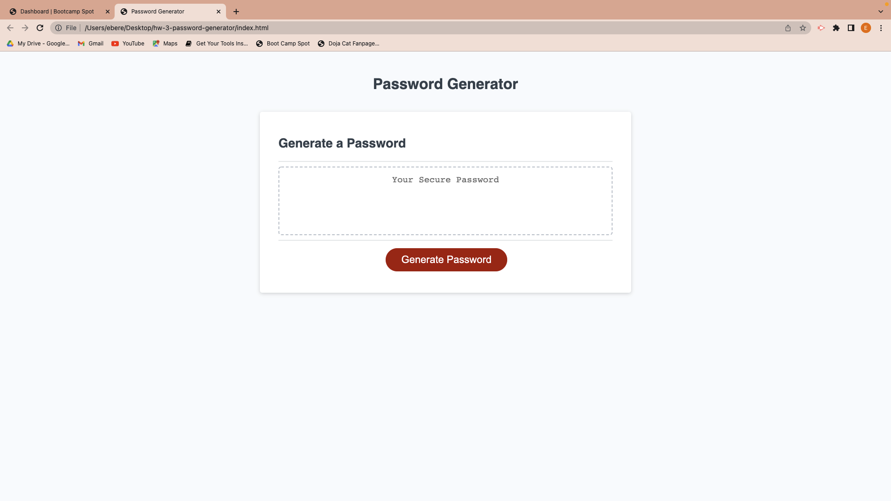

# hw-3-password-generator

# OVERVIEW
The aim of this project was to modify starter code to enable a user to generate passwords based on their chosen criteria. 
Starter code included full HTML and CSS code needed to be powered up by Javascript.

## Description
* This appplication was modified to generate random passwords on command after criteria has been chosen.
* This appplication includes a pre coded HTML and CSS along with javascript added by me. 
* This apllication is interactive. 
* Application has been deployed to Github pages.

## SCREENSHOTS

* Screenshot of page
 